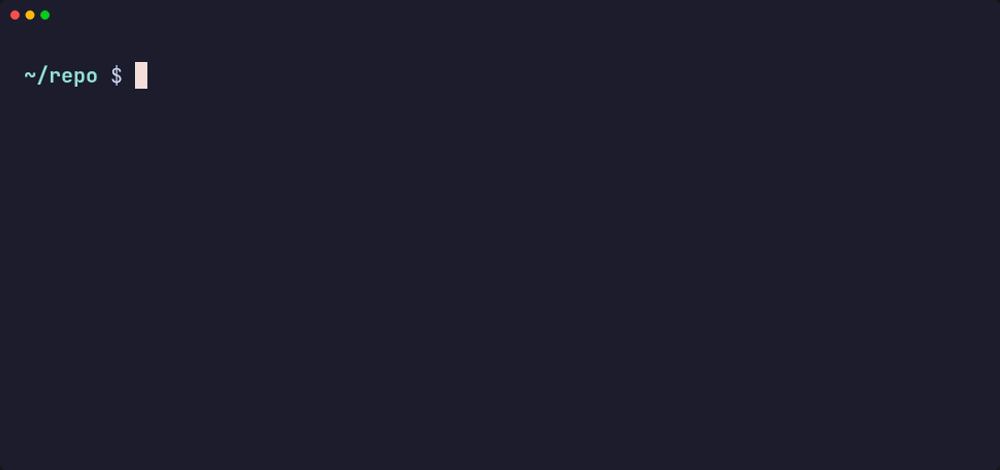
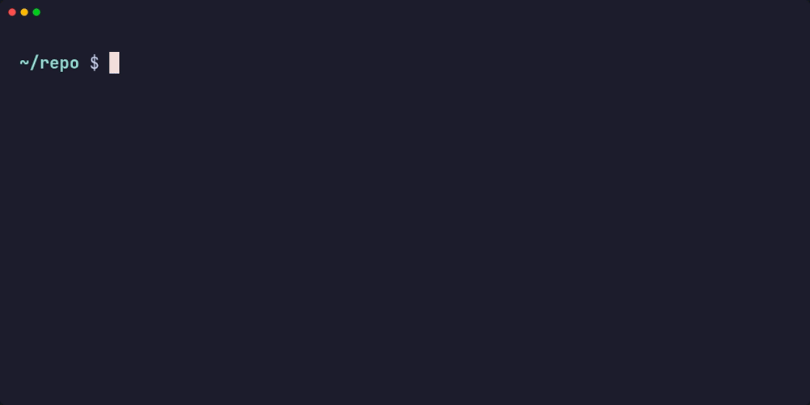

# gwx

[](https://github.com/ktakada42/gwx/actions/workflows/ci.yml)
[](https://github.com/ktakada42/gwx/actions/workflows/release.yml)
[](https://codecov.io/gh/ktakada42/gwx)
[](https://github.com/ktakada42/gwx/releases/latest)
[](LICENSE)

A friendly `git worktree` manager, written in Rust.

`git worktree` is great, but it makes you repeat yourself: you type the branch
name, then a path for it, then you copy over your `.env`, then you reinstall
dependencies, and finally you `cd` into a directory you have to remember.
`gwx` takes care of all of that.

**`gwx add <branch>`** — a branch name is all it takes. The branch is created
when it does not exist, the worktree lands at a path derived from its name, and
the hooks in `.gwx.toml` bring the `.env` and the dependencies along.



**`gwx list`** — the picker. Type to filter, <kbd>Enter</kbd> to change into the
worktree, <kbd>Ctrl</kbd>+<kbd>d</kbd> to remove it. `--plain` prints the table
instead, for reading or piping.


**`gwx remove <name>`** — the worktree, and with `--with-branch` the branch it
was for, as long as it is merged.



> [!NOTE]
> `gwx` is inspired by [satococoa/wtp](https://github.com/satococoa/wtp), a Go
> tool with the same goal that is no longer actively maintained. `gwx` is an
> independent reimplementation in Rust — the configuration file and the CLI are
> similar in spirit but not compatible.

## Features

- **One command per branch.** `gwx add <branch>` creates the worktree at a
  predictable path, so you never type a directory name.
- **Branches are created when missing.** An existing local branch is checked
  out, a remote-only branch is tracked, and anything else becomes a new branch.
- **Hooks.** Copy files, create symlinks and run commands around creation and
  removal, configured per repository in `.gwx.toml` — so the containers and
  caches a worktree brought up leave with it.
- **List and navigate.** `gwx list` opens an interactive list — move, filter,
  press <kbd>Enter</kbd> to go there or <kbd>Ctrl</kbd>+<kbd>d</kbd> to delete.
  `gwx cd <name>` jumps straight to one, with tab completion.

## Installation

### Homebrew (macOS / Linux)

```bash
brew install ktakada42/tap/gwx
```

To upgrade:

```bash
brew upgrade gwx
```

### Shell script (macOS / Linux)

```bash
curl -fsSL https://raw.githubusercontent.com/ktakada42/gwx/main/install.sh | sh
```

Installs to `~/.local/bin` by default. Override with `INSTALL_DIR`:

```bash
curl -fsSL https://raw.githubusercontent.com/ktakada42/gwx/main/install.sh | INSTALL_DIR=/usr/local/bin sh
```

### cargo install

Requires a [Rust](https://rustup.rs) toolchain.

```bash
cargo install --git https://github.com/ktakada42/gwx
```

`gwx` is not on crates.io, so `--git` is the way in for now.

### Build from source

```bash
git clone https://github.com/ktakada42/gwx
cd gwx
cargo build --release
./target/release/gwx --help
```

Requires Rust 1.85+ to build and Git 2.17+ at runtime. Linux and macOS are
supported; on Windows the `symlink` hook needs developer mode or elevation.

### Shell integration

A process cannot change the directory of the shell that started it, so `gwx cd`
prints a path and a small shell function does the actual `cd`. The same snippet
registers tab completion for worktree and branch names.

```bash
# ~/.bashrc
eval "$(gwx shell-init bash)"

# ~/.zshrc  (after compinit)
eval "$(gwx shell-init zsh)"

# ~/.config/fish/config.fish
gwx shell-init fish | source
```

Homebrew installs the completion scripts for you, but `gwx cd` still needs the
snippet above.

Without the integration everything still works:

```bash
cd "$(gwx cd feature/auth)"
```

### Completion

Completion is computed by `gwx` itself while you type, so it knows about your
repository:

```console
$ gwx cd <TAB>
@                    -- main worktree — /home/me/repo
feature/auth         -- /home/me/worktrees/feature/auth

$ gwx add <TAB>
hotfix/login         -- local branch
release/2.1          -- origin/release/2.1

$ gwx remove <TAB>   # every worktree except the main one
$ gwx add x --from <TAB>   # branches, tags and remote-tracking branches
```

`gwx add` only offers branches that do not have a worktree yet — the ones it
would actually accept — and remote-only branches under the short name you would
type. Outside a repository nothing is offered instead of an error.

## Commands

| Command | What it does |
| --- | --- |
| `gwx add <branch>` | Create a worktree for `<branch>`, creating the branch if needed |
| `gwx list` (`ls`) | Pick a worktree interactively; `--plain` or `--paths` for text |
| `gwx cd [<name>]` | Move into a worktree; with no argument, to the main one |
| `gwx remove <name>` (`rm`) | Remove a worktree, optionally with its branch |
| `gwx init` | Write a `.gwx.toml` template |
| `gwx shell-init <shell>` | Print the `cd` function and the completion hookup |
| `gwx completion <shell>` | Print the completion hookup only |

`<name>` is matched against branch names first, then paths below `base_dir`,
then directory names — so `gwx cd feature/auth` and `gwx cd auth` both work
when they are unambiguous.

A bare `gwx cd` goes to the main worktree, the way a bare `cd` takes you home.
`gwx cd @` says the same thing explicitly. To choose from a list instead, use
`gwx list`.

### Picking a worktree interactively

`gwx list` opens a list you can move through:

```
  WORKTREE         HEAD     STATUS
* @                a1b2c3d
  feature/auth     a1b2c3d  dirty, merged
  feature/billing  a1b2c3d  merged
  hotfix           3d3cc2d

> _ type to filter                                        4 worktrees
 up/down  move   enter  cd   ctrl-d   backspace  delete   esc  cancel
```

The table starts at the top, so the header sits against the rows it labels.
The filter joins the help line at the bottom, where the things you operate
live.

The filter line carries a block cursor and, on the right, how much of the list
you are looking at — `1 of 4` once you start typing, so filtering everything
away reads as `0 of 4` rather than an unexplained blank screen.

Each row says what you need before acting on it: `dirty` for uncommitted
changes, `merged` when the branch is already in the main worktree's `HEAD`.
The `STATUS` column fills in a moment after the list appears — working it out
costs a `git status` per worktree, which the list does not wait for.
The path is not shown — gwx derives it from the branch name, so it only
repeated what the first column already said.

Each part of the screen is told apart by a different attribute rather than by
shade alone: the header is bold and underlined, the selected row is highlighted
across the full width, each key in the help line sits in a reverse-video badge,
and only the hints that fade — the placeholder and the count — are dimmed. A
`*` in the first column marks the worktree you are standing in.

| Key | Action |
| --- | --- |
| <kbd>↑</kbd> <kbd>↓</kbd> (or <kbd>Ctrl</kbd>+<kbd>p</kbd> / <kbd>n</kbd>) | Move the cursor |
| type anything | Filter by name or path |
| <kbd>Enter</kbd> | Change into the selected worktree |
| <kbd>Backspace</kbd> | Erase the filter, or remove the worktree once it is empty |
| <kbd>Ctrl</kbd>+<kbd>d</kbd> or <kbd>Delete</kbd> | Remove the worktree, whatever you have typed |
| <kbd>Esc</kbd> or <kbd>Ctrl</kbd>+<kbd>c</kbd> | Leave without moving |

<kbd>Backspace</kbd> does double duty so that the key labelled "delete" on Mac
keyboards — which sends Backspace, not Delete — can remove a worktree. The
bottom line always says which of the two it will do right now. On a narrow
terminal it drops `up/down move` first rather than cutting a word in half.

Holding <kbd>Backspace</kbd> to clear what you typed cannot run past the empty
filter into the delete dialog: the press at that boundary is swallowed, so
reaching the dialog always takes a deliberate keystroke.

Everything the picker draws is plain ASCII, so it does not depend on the font
having arrow or return glyphs.

The confirmation dialog names what is at stake before you answer — uncommitted
changes, and whether the branch is merged:

```
Remove this worktree?

  /home/me/worktrees/feature/auth

  ! uncommitted changes will be lost
  branch `feature/auth` (merged)

[y] remove worktree   [b] remove worktree and branch   [n] cancel
```

The main worktree and the one you are standing in are refused outright, same as
`gwx remove`.

Two cases skip the picker entirely: when there is no terminal to draw on (a
script, a pipe, CI) and when the repository has no worktree other than the main
one. `gwx list` then prints its table, exactly as before, so existing scripts
keep working. Ask for text in a terminal with `gwx list --plain`, or
`gwx list --paths` for one path per line.

The picker hands the directory to the shell function through a temporary file
named by `GWX_CD_FILE`, which leaves stdout free for `gwx list` to print on.
That means `gwx shell-init` changed in v1.1.0: after upgrading, start a new
shell (or re-source your rc file) before `gwx list` can move you.

### `gwx add`

```
gwx add <branch> [--from <commit-ish>] [--path <path>]
                 [--no-create] [--no-hooks] [--force] [--quiet]
```

The branch is resolved in this order:

1. **Local branch exists** → check it out.
2. **Exactly one remote branch matches** → create a local branch tracking it
   (`origin/feature/auth` → `feature/auth`).
3. **Otherwise** → create the branch from `HEAD`, or from `--from` when given.

Use `--no-create` to fail instead of creating a branch, `--path` to override
the generated path, and `--quiet` to print only the resulting path — handy in
scripts:

```bash
cd "$(gwx add feature/auth --quiet)"
```

### `gwx remove`

```
gwx remove <name> [--with-branch] [--force] [--no-hooks]
```

Refuses to delete the main worktree, the worktree you are standing in, or one
with uncommitted changes. `--with-branch` also deletes the branch, but only
when it is merged into `HEAD` of the main worktree; `--force` overrides both
checks. `--no-hooks` skips the `pre_remove` and `post_remove` hooks, which is
the way out when a hook itself is what stands between you and a stale
worktree.

## Configuration

`gwx` reads `.gwx.toml` from the **main worktree** — the original clone — no
matter which worktree you run it from, so hook paths always mean the same
thing. Run `gwx init` to get a commented template. Everything is optional.

```toml
version = "1"

[defaults]
# Where worktrees are created, relative to the main worktree.
base_dir = "../worktrees"

# Runs before the worktree exists, in the main worktree. Commands only.
[[hooks.pre_create]]
type = "command"
command = "git fetch --prune"

# Runs inside the new worktree, in order.
[[hooks.post_create]]
type = "copy"
from = ".env"          # relative to the main worktree
to = ".env"            # relative to the new worktree; defaults to `from`

# Share one node_modules with the main worktree. On macOS a `copy` is a
# clone and costs about the same — see below for which to pick.
[[hooks.post_create]]
type = "symlink"
from = "node_modules"

[[hooks.post_create]]
type = "command"
command = "npm install"
work_dir = "."         # relative to the new worktree
env = { NODE_ENV = "development" }

# Runs inside the worktree while it is still there. Commands only.
# A failure calls the removal off.
[[hooks.pre_remove]]
type = "command"
command = "docker compose down"

# Runs once the worktree is gone, in the main worktree. Commands only.
[[hooks.post_remove]]
type = "command"
command = "rm -rf \"$GWX_MAIN_WORKTREE/.cache/$GWX_WORKTREE_NAME\""
```

With `base_dir = "../worktrees"`, a repository at `/home/me/repo` puts the
worktree for `feature/auth` at `/home/me/worktrees/feature/auth`. Slashes in
branch names become directories. An absolute `base_dir` is used as-is.

### Hook phases

| Phase | When | Runs in |
| --- | --- | --- |
| `pre_create` | Before the worktree exists | Main worktree |
| `post_create` | Once the worktree is checked out | New worktree |
| `pre_remove` | Before the worktree is deleted | The worktree being removed |
| `post_remove` | After the worktree — and the branch, with `--with-branch` — is gone | Main worktree |

`post_create` is the only phase with a worktree that is both there and staying,
so it is the only one that takes `copy` and `symlink` hooks. The other three
take `command` hooks, which is what stopping a container or deleting a volume
needs anyway.

The two removal phases run for `gwx remove` and for deleting from the picker
alike — a worktree brought down by <kbd>Ctrl</kbd>+<kbd>d</kbd> is no less
removed. The picker owns the screen while it runs, so it keeps what hooks print
to itself and shows only what a failing one said last.

### Hook types

| Type | Keys | Notes |
| --- | --- | --- |
| `copy` | `from`, `to` | Copies files and directories, including gitignored ones such as `.env` |
| `symlink` | `from`, `to` | Links to the file in the main worktree, for caches you want to share |
| `command` | `command`, `work_dir`, `env` | Run through `/bin/sh -c` |

`from` and `to` are relative paths that may not escape their worktree.

> [!NOTE]
> **A `copy` keeps symlinks as symlinks.** It recreates them rather than
> following them, dangling ones included — `node_modules/.bin` is full of
> relative links that only work that way, and a removed package leaves behind
> links pointing at nothing.

> [!TIP]
> **On macOS a `copy` is a clone.** APFS shares the blocks between the two
> directories until one of them is written to, and gwx clones the whole tree in
> a single `clonefile` call. A `node_modules` of 10,000 files took **0.13s**,
> against 2.0s for the same copy made file by file — and neither one spends the
> disk space. On Linux a `copy` is a real copy of both the time and the space.

### `copy` or `symlink` for `node_modules`?

Both hooks exist because the answer depends on your platform and on how much
the worktrees should be able to diverge.

| | `copy` | `symlink` |
| --- | --- | --- |
| Disk | Shared blocks on macOS; a real second copy on Linux | Nothing |
| Time | One clone on macOS; file by file on Linux | Instant |
| Installing | Each worktree installs on its own | One directory for all of them — an install in one is an install in every one |

On macOS, `copy` is close to free and leaves the worktrees independent, which
is the reason to prefer it. On Linux, `symlink` is what keeps a large
`node_modules` from being duplicated per worktree — as long as you are not
running installs of different dependency sets side by side.

Every hook sees these environment variables:

| Variable | Value |
| --- | --- |
| `GWX_BRANCH` | Branch of the worktree, empty when it has none |
| `GWX_WORKTREE_NAME` | Name of the worktree |
| `GWX_WORKTREE_PATH` | Absolute path of the worktree — in `post_remove`, of the directory that was just deleted |
| `GWX_MAIN_WORKTREE` | Absolute path of the main worktree |

A failing hook stops the sequence and makes the command exit non-zero, and the
phase decides what that means. A `pre_create` or `pre_remove` failure blocks the
operation: nothing is created, nothing is deleted. By the time `post_create` or
`post_remove` fails the worktree has already been created or removed, so the
error says so and the state stands. Pass `--no-hooks` to `gwx add` or
`gwx remove` to skip them entirely.

## Contributing

Issues and pull requests are welcome — bug reports, ideas for the picker, hook
types you wanted and did not find. Please write them in English so everyone
reading the repository can follow along.

### Getting set up

Requires Rust 1.85+ and Git 2.17+.

```bash
git clone https://github.com/ktakada42/gwx
cd gwx
cargo test           # unit tests plus end-to-end tests against real repos
```

The end-to-end tests in `tests/cli.rs` create real repositories in a temporary
directory and drive the built binary against them, so they need `git` on your
PATH and nothing else. They are the fastest way to see how a command is
expected to behave.

To try your build without disturbing an installed copy:

```bash
cargo build --release
export PATH="$PWD/target/release:$PATH"   # this shell only
eval "$(gwx shell-init zsh)"
```

### Before opening a pull request

```bash
cargo fmt --all
cargo clippy --all-targets -- -D warnings
cargo test --all
```

CI runs the same three on Linux and macOS. Add a test with a behaviour change —
`tests/cli.rs` for anything a user can observe from the command line, unit
tests next to the code for the rest.

Or let a hook run them for you:

```bash
git config core.hooksPath .githooks
```

`.githooks/pre-commit` runs all three before each commit. A commit touching no
Rust — a README fix, say — skips clippy and the tests and returns straight
away, so only the commits that could break the build pay for the wait.

Commit messages follow [Conventional Commits](https://www.conventionalcommits.org)
(`feat(list):`, `fix(tui):`, `docs(readme):`). Say why in the body; the diff
already says what.

Adding a dependency pulls in two more checks, both running whenever
`Cargo.lock` changes. gwx ships prebuilt binaries, so whatever a dependency
brings with it reaches everyone who installs gwx, not only the people who
rebuild from source.

- `cargo audit`, against the [RustSec advisory database](https://rustsec.org),
  and again every Monday — an advisory can appear without anything here
  changing.
- `cargo deny check licenses`, against the policy in `deny.toml`. gwx is MIT,
  so a copyleft dependency arriving in a routine version bump would leave the
  released binaries undistributable.

Both are worth running before you propose a new dependency:

```bash
cargo audit
cargo deny check licenses
```

Everything written into the repository is in English: commits, issues, pull
requests, code, comments and docs. History up to v1.3.2 is in Japanese and
stays that way — tags and releases point at those commits, so rewriting them
would break every link for no real gain.

### Finding your way around

| Path | What lives there |
| --- | --- |
| `src/cli.rs` | The command line, and which completions each argument offers |
| `src/commands/` | One module per subcommand |
| `src/tui.rs` | The interactive picker |
| `src/hooks.rs` | Running `.gwx.toml` hooks |
| `src/git.rs` | Every call out to `git` |
| `src/cd_target.rs` | Handing a directory back to the shell |

Two constraints are easy to trip over. The picker draws to `/dev/tty` rather
than stdout, because stdout carries the chosen directory back to the shell
function — anything printed there ends up in a `cd`. And everything the picker
draws is plain ASCII: arrows and box-drawing characters are missing from some
fonts, and characters with an emoji presentation render double width and shift
the columns out of alignment.

## License

MIT — see [LICENSE](LICENSE).
